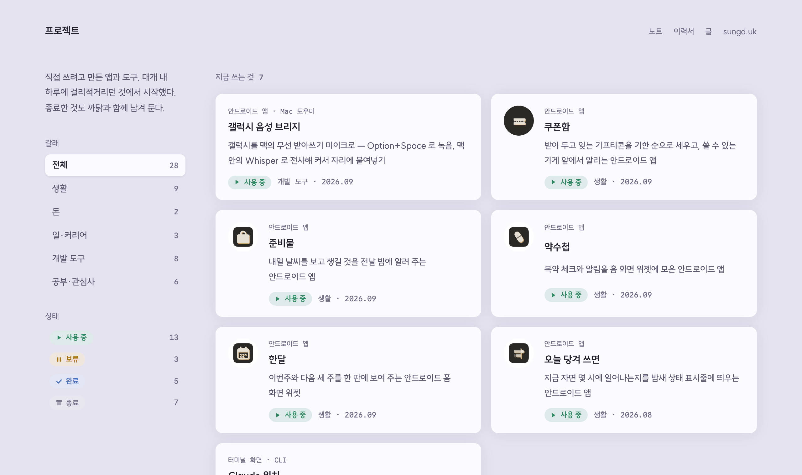

<div align="center">

# dev.sungd.uk

직접 만든 앱, 도구, 대시보드와 개발 노트

[**dev.sungd.uk**](https://dev.sungd.uk/) &nbsp;·&nbsp; [노트](https://dev.sungd.uk/notes/)



</div>

<details>
<summary><b>개발</b></summary>

### 구조

```
src/content/projects/   프로젝트 한 편 = 파일 하나 (.md · 그림을 직접 배치하면 .mdx)
src/pages/index.astro   목록 — 대표 한 편 + 갈래별
src/pages/[slug].astro  글 한 편
src/styles/site.css     토큰과 화면 전부. sungd.uk 랜딩과 같은 계열
public/p/<슬러그>/       그 프로젝트의 그림과, 열어볼 수 있게 옮겨 둔 페이지
```

### 머리말

| 키 | 무엇 |
|---|---|
| `title` `tagline` `period` | 목록과 글머리에 그대로 뜬다 |
| `status` | 사용 중 · 보류 · 완료 · 종료. 목록 카드와 글머리에 배지로 선다 |
| `purpose` | 갈래 — 생활 · 돈 · 일·커리어 · 개발 도구 · 공부·관심사. 목록 위 칩으로 거른다 |
| `ended` | 보류하거나 종료한 까닭 한 줄. 카드와 글머리에 선다 |
| `draft` | 페이지를 안 연 편. 목록에 카드만 흐리게 선다 |
| `tags` `github` `link` `linkLabel` | 글머리 메타 줄 |
| `cover` `coverLight` | 밤·낮 판. 목록 대표 그림과 og 이미지 |
| `headCover` | 글머리에 그림을 자동으로 세울지. 본문에서 직접 놓으면 `false` |
| `use` | 이럴 때 쓴다 — 서너 줄 |
| `shots` | 그전 모습 (`src` · `label` · `note`) |
| `feature` | 목록 맨 위에 크게. 하나만 |

### 만들기

```bash
npm install
npm run dev        # localhost:4321
npm run build      # dist/
```

`main` 에 올리면 Actions 가 GitHub Pages 로 올린다. 도메인은 Cloudflare 에서
`dev` → `CNAME newhigen.github.io` (회색 구름).

### 남은 것

</details>

<details>
<summary><b>다른 사이트</b></summary>

- [sungd.uk](https://sungd.uk/) — 소개, 이력서, 활동
- [writing.sungd.uk](https://writing.sungd.uk/) — 책, 생각, 기술 글
- [books.sungd.uk](https://books.sungd.uk/) — 흩어진 책을 한 장에
- [ai.sungd.uk](https://ai.sungd.uk/) — 오늘 써 볼 AI 도구

</details>
